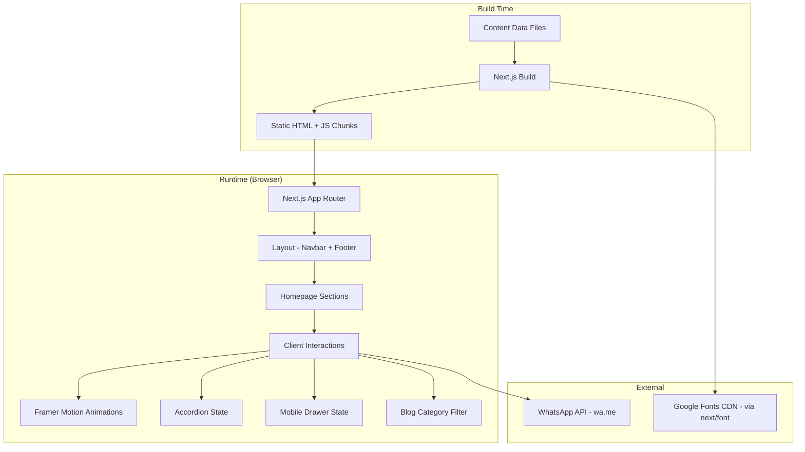
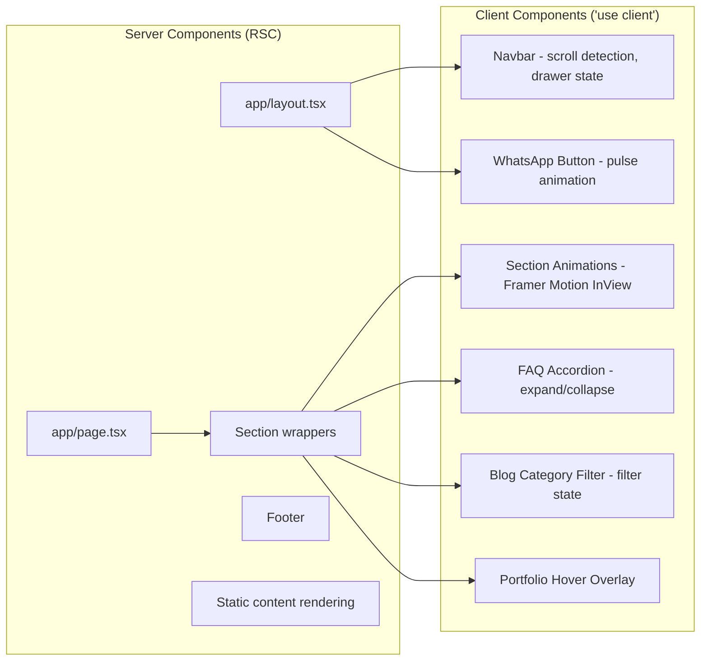

# Design Document: NexaPlus Website

## Overview

NexaPlus (nexaplus.app) is a single-page premium digital agency website built with Next.js 15 App Router, TypeScript, Tailwind CSS v4, shadcn/ui, and Framer Motion. The site is a lead-generation tool targeting Indonesian SMBs, marketplace sellers, schools, government agencies, and organizations. It converts visitors into WhatsApp inquiries through a sequence of trust-building sections.

The architecture follows a component-driven approach where each homepage section is an isolated, self-contained component receiving data from static content files. The site uses static generation (SSG) for optimal performance, with minimal client-side JavaScript limited to animations, accordion interactions, and mobile navigation state.

### Key Design Decisions

1. **Static Site Generation (SSG)**: All pages are pre-rendered at build time. No server-side runtime needed since content is static.
2. **Content-as-Data**: All section content (services, benefits, testimonials, pricing, FAQ, portfolio, blog) lives in TypeScript data files, enabling type safety and easy content updates without touching component logic.
3. **Component Isolation**: Each section is a standalone React component with its own animation configuration, responsive behavior, and accessibility attributes.
4. **Progressive Enhancement**: Core content is server-rendered HTML. Animations and interactions layer on top via client components.
5. **Mobile-First CSS**: Base Tailwind styles target mobile; `md:` and `lg:` breakpoints enhance for larger viewports.

## Architecture

### High-Level Architecture



### Project Structure

```
nexaplus.app/
├── app/
│   ├── layout.tsx              # Root layout (Navbar, Footer, WhatsApp button)
│   ├── page.tsx                # Homepage (all sections composed)
│   ├── blog/
│   │   └── [slug]/
│   │       └── page.tsx        # Individual blog article page
│   ├── portfolio/
│   │   └── [slug]/
│   │       └── page.tsx        # Project detail page
│   ├── sitemap.ts              # Dynamic sitemap generation
│   └── robots.ts               # Robots.txt generation
├── components/
│   ├── layout/
│   │   ├── navbar.tsx          # Fixed navigation with mobile drawer
│   │   ├── footer.tsx          # Footer with columns
│   │   └── whatsapp-button.tsx # Floating WhatsApp FAB
│   ├── sections/
│   │   ├── hero-section.tsx
│   │   ├── trust-section.tsx
│   │   ├── problem-section.tsx
│   │   ├── services-section.tsx
│   │   ├── benefits-section.tsx
│   │   ├── portfolio-section.tsx
│   │   ├── process-section.tsx
│   │   ├── testimonial-section.tsx
│   │   ├── pricing-section.tsx
│   │   ├── faq-section.tsx
│   │   ├── blog-section.tsx
│   │   └── final-cta-section.tsx
│   ├── ui/                     # shadcn/ui components
│   │   ├── accordion.tsx
│   │   ├── button.tsx
│   │   ├── card.tsx
│   │   ├── badge.tsx
│   │   └── ...
│   └── shared/
│       ├── section-wrapper.tsx  # Reusable section container with animation
│       ├── animated-card.tsx    # Card with hover scale effect
│       └── star-rating.tsx     # Star rating display component
├── data/
│   ├── services.ts
│   ├── benefits.ts
│   ├── portfolio.ts
│   ├── process-steps.ts
│   ├── testimonials.ts
│   ├── pricing.ts
│   ├── faq.ts
│   ├── blog-posts.ts
│   ├── navigation.ts
│   └── site-config.ts         # WhatsApp number, brand info, meta tags
├── lib/
│   ├── whatsapp.ts            # WhatsApp URL builder with pre-filled messages
│   ├── schema-markup.ts       # JSON-LD structured data generators
│   ├── utils.ts               # cn() helper, formatDate, etc.
│   └── animations.ts          # Framer Motion variant presets
├── styles/
│   └── globals.css            # Tailwind directives, CSS custom properties
├── public/
│   ├── images/
│   │   ├── portfolio/
│   │   ├── testimonials/
│   │   ├── trust-logos/
│   │   └── hero-mockup.webp
│   └── icons/
├── next.config.ts
├── tailwind.config.ts
├── tsconfig.json
└── package.json
```

### Rendering Strategy

| Route | Strategy | Reason |
|-------|----------|--------|
| `/` (homepage) | Static (SSG) | All content is static data |
| `/blog/[slug]` | Static (SSG) with `generateStaticParams` | Blog content known at build time |
| `/portfolio/[slug]` | Static (SSG) with `generateStaticParams` | Portfolio content known at build time |
| `/sitemap.xml` | Route Handler | Auto-generated from known routes |
| `/robots.txt` | Route Handler | Static configuration |

### Client vs Server Component Boundary



## Components and Interfaces

### Layout Components

#### Navbar (`components/layout/navbar.tsx`)
```typescript
'use client';

interface NavbarProps {
  logo: string;
  links: NavLink[];
  whatsappUrl: string;
}

interface NavLink {
  label: string;
  href: string; // Section anchor like "#layanan"
}
```

**Behavior:**
- Fixed position with `z-50`
- Transparent background at scroll offset 0
- Glassmorphism background (`bg-white/5 backdrop-blur-md`) when scrolled
- Desktop: horizontal link list + CTA button
- Mobile (<768px): hamburger icon → slide-in drawer (300ms transition)
- Drawer closes on link click with smooth-scroll to section

#### Footer (`components/layout/footer.tsx`)
```typescript
interface FooterProps {
  brand: BrandInfo;
  navigation: NavLink[];
  services: ServiceLink[];
  contact: ContactInfo;
}

interface ContactInfo {
  whatsapp: string;
  email: string;
  socialLinks: { platform: string; url: string; icon: string }[];
}
```

#### WhatsApp Floating Button (`components/layout/whatsapp-button.tsx`)
```typescript
'use client';

interface WhatsAppButtonProps {
  phoneNumber: string;
  message?: string;
}
```

**Behavior:**
- Fixed bottom-right (16-24px offset), z-index above all content
- Minimum 48x48px touch target
- Pulse animation (1500-3000ms cycle) via Framer Motion
- Respects `prefers-reduced-motion` — disables pulse when enabled
- Opens `wa.me/{number}?text={message}` in new tab

### Section Wrapper Component

```typescript
'use client';

interface SectionWrapperProps {
  id: string;           // For anchor navigation
  children: React.ReactNode;
  className?: string;
  animate?: boolean;    // Default true, respects reduced-motion
}
```

Wraps each homepage section with:
- Semantic `<section>` element with `id` for anchor links
- Framer Motion `useInView` hook for fade-up entrance animation
- Configurable animation (300-600ms duration, 0.2 threshold)
- Automatically disables animation when `prefers-reduced-motion` is active

### Section Components

Each section component follows this pattern:
1. Imports data from `data/` files
2. Renders content with responsive Tailwind classes
3. Uses `SectionWrapper` for animation
4. Client-only logic (hover, filter) in sub-components

#### Hero Section
```typescript
// Server component with client sub-component for CTA tracking
interface HeroData {
  headline: string;
  subheadline: string;
  ctaPrimary: { label: string; whatsappMessage: string };
  ctaSecondary: { label: string; targetSection: string };
  mockupImage: string;
}
```

#### Services Section
```typescript
interface Service {
  id: string;
  icon: string;
  title: string;
  description: string;     // max 150 chars
  whatsappMessage: string;  // pre-filled for this service
}
```

#### Pricing Section
```typescript
interface PricingTier {
  id: string;
  name: string;
  targetAudience: string;
  price: string;
  features: string[];       // min 3 features
  isRecommended: boolean;   // true for Professional tier
  whatsappMessage: string;
}
```

#### FAQ Section
```typescript
'use client';

interface FAQItem {
  id: string;
  question: string;
  answer: string;           // max 80 words for AEO
}
```

**Behavior:**
- Uses shadcn/ui Accordion component (single mode — only one expanded at a time)
- All items collapsed initially
- Keyboard accessible (Enter/Space to toggle, arrow keys to navigate)
- `aria-expanded` updates on state change
- Generates FAQPage JSON-LD schema

#### Blog Section
```typescript
'use client';

interface BlogPost {
  slug: string;
  title: string;           // max 80 chars
  excerpt: string;         // max 150 chars
  category: BlogCategory;
  publishedDate: Date;
  coverImage: string;
}

type BlogCategory = 'SEO' | 'Website' | 'Bisnis Online' | 'UMKM' | 'Toko Online';
```

**Behavior:**
- Category filter buttons with "All" default
- Client-side filtering (filter state in `useState`)
- Grid: 1 col mobile, 3 col desktop
- Date formatted as "DD MMM YYYY" (Indonesian locale)

#### Portfolio Section
```typescript
interface PortfolioItem {
  slug: string;
  name: string;
  category: ServiceCategory;
  screenshot: string;
  description: string;
}

type ServiceCategory = 'Toko Online' | 'Landing Page' | 'Company Profile' | 'Website Sekolah' | 'Website Pemerintahan' | 'Website Organisasi';
```

**Behavior:**
- Hover overlay with "Lihat Detail" button (200-300ms transition)
- Click navigates to `/portfolio/[slug]`
- Grid: 1 col mobile, 2 col tablet, 3 col desktop

### Shared Utility Components

#### AnimatedCard
```typescript
'use client';

interface AnimatedCardProps {
  children: React.ReactNode;
  className?: string;
  hoverScale?: number;    // 1.02 - 1.05, default 1.03
}
```

Applies Framer Motion `whileHover` scale transform with 200ms transition.

#### StarRating
```typescript
interface StarRatingProps {
  rating: number;         // 1-5
  maxStars?: number;      // default 5
}
```

Renders filled/unfilled star SVG icons with appropriate `aria-label`.

## Data Models

### Site Configuration (`data/site-config.ts`)

```typescript
export const siteConfig = {
  name: 'NexaPlus',
  url: 'https://nexaplus.app',
  whatsapp: {
    number: '62XXXXXXXXXX',   // Indonesian phone number
    defaultMessage: 'Halo NexaPlus, saya tertarik dengan jasa pembuatan website.',
  },
  meta: {
    title: 'Jasa Pembuatan Website Profesional | NexaPlus',
    description: 'Jasa pembuatan website profesional untuk UMKM, perusahaan, toko online, landing page dan company profile. SEO Friendly, cepat dan mobile friendly.',
    ogImage: '/images/og-image.jpg',
  },
  colors: {
    background: '#050816',
    primary: '#2563EB',
    secondary: '#7C3AED',
    accent: '#22D3EE',
    text: '#FFFFFF',
  },
  fonts: {
    primary: 'Inter',
  },
} as const;
```

### Navigation Data (`data/navigation.ts`)

```typescript
export interface NavLink {
  label: string;
  href: string;
}

export const navLinks: NavLink[] = [
  { label: 'Beranda', href: '#beranda' },
  { label: 'Layanan', href: '#layanan' },
  { label: 'Portfolio', href: '#portfolio' },
  { label: 'Harga', href: '#harga' },
  { label: 'FAQ', href: '#faq' },
  { label: 'Blog', href: '#blog' },
  { label: 'Kontak', href: '#kontak' },
];
```

### WhatsApp URL Builder (`lib/whatsapp.ts`)

```typescript
export interface WhatsAppLinkOptions {
  phoneNumber: string;
  message?: string;
}

export function buildWhatsAppUrl(options: WhatsAppLinkOptions): string {
  const { phoneNumber, message } = options;
  const baseUrl = `https://wa.me/${phoneNumber}`;
  if (message) {
    return `${baseUrl}?text=${encodeURIComponent(message)}`;
  }
  return baseUrl;
}

export function buildServiceWhatsAppUrl(serviceName: string): string {
  return buildWhatsAppUrl({
    phoneNumber: siteConfig.whatsapp.number,
    message: `Halo NexaPlus, saya tertarik dengan layanan ${serviceName}. Bisa konsultasi?`,
  });
}

export function buildPricingWhatsAppUrl(tierName: string): string {
  return buildWhatsAppUrl({
    phoneNumber: siteConfig.whatsapp.number,
    message: `Halo NexaPlus, saya tertarik dengan paket ${tierName}. Bisa info lebih lanjut?`,
  });
}
```

### Schema Markup Generator (`lib/schema-markup.ts`)

```typescript
export interface SchemaOrganization {
  '@context': 'https://schema.org';
  '@type': 'Organization';
  name: string;
  url: string;
  logo: string;
  contactPoint: {
    '@type': 'ContactPoint';
    telephone: string;
    contactType: 'customer service';
  };
  sameAs: string[];
}

export interface SchemaLocalBusiness {
  '@context': 'https://schema.org';
  '@type': 'LocalBusiness';
  name: string;
  description: string;
  url: string;
  telephone: string;
  address: {
    '@type': 'PostalAddress';
    addressCountry: 'ID';
  };
  priceRange: string;
}

export interface SchemaService {
  '@context': 'https://schema.org';
  '@type': 'Service';
  name: string;
  description: string;
  provider: { '@type': 'Organization'; name: string };
  areaServed: { '@type': 'Country'; name: 'Indonesia' };
}

export interface SchemaFAQPage {
  '@context': 'https://schema.org';
  '@type': 'FAQPage';
  mainEntity: {
    '@type': 'Question';
    name: string;
    acceptedAnswer: {
      '@type': 'Answer';
      text: string;
    };
  }[];
}

export interface SchemaArticle {
  '@context': 'https://schema.org';
  '@type': 'Article';
  headline: string;
  description: string;
  datePublished: string;
  author: { '@type': 'Organization'; name: string };
}

export function generateOrganizationSchema(): SchemaOrganization { /* ... */ }
export function generateLocalBusinessSchema(): SchemaLocalBusiness { /* ... */ }
export function generateServiceSchemas(services: Service[]): SchemaService[] { /* ... */ }
export function generateFAQSchema(items: FAQItem[]): SchemaFAQPage { /* ... */ }
export function generateArticleSchema(post: BlogPost): SchemaArticle { /* ... */ }
```

### Animation Presets (`lib/animations.ts`)

```typescript
import { Variants } from 'framer-motion';

export const fadeUpVariants: Variants = {
  hidden: { opacity: 0, y: 30 },
  visible: {
    opacity: 1,
    y: 0,
    transition: { duration: 0.5, ease: 'easeOut' },
  },
};

export const cardHoverVariants = {
  rest: { scale: 1 },
  hover: { scale: 1.03, transition: { duration: 0.2 } },
};

export const navbarTransition = {
  duration: 0.2,
  ease: 'easeInOut',
};

export const drawerVariants: Variants = {
  closed: { x: '100%', transition: { duration: 0.3 } },
  open: { x: 0, transition: { duration: 0.3 } },
};

export const pulseVariants: Variants = {
  pulse: {
    scale: [1, 1.1, 1],
    boxShadow: [
      '0 0 0 0 rgba(37, 211, 102, 0.4)',
      '0 0 0 10px rgba(37, 211, 102, 0)',
      '0 0 0 0 rgba(37, 211, 102, 0)',
    ],
    transition: { duration: 2, repeat: Infinity },
  },
};
```

### Blog Category Filter Logic

```typescript
export function filterBlogPosts(
  posts: BlogPost[],
  category: BlogCategory | 'All'
): BlogPost[] {
  if (category === 'All') return posts;
  return posts.filter((post) => post.category === category);
}

export function formatDate(date: Date): string {
  return date.toLocaleDateString('id-ID', {
    day: '2-digit',
    month: 'short',
    year: 'numeric',
  });
}
```


## Correctness Properties

*A property is a characteristic or behavior that should hold true across all valid executions of a system — essentially, a formal statement about what the system should do. Properties serve as the bridge between human-readable specifications and machine-verifiable correctness guarantees.*

### Property 1: WhatsApp URL Generation

*For any* non-empty service name or tier name string, the `buildWhatsAppUrl` function SHALL produce a URL that starts with `https://wa.me/`, contains the configured phone number, and includes a `text` query parameter whose decoded value contains the input string.

**Validates: Requirements 4.5, 9.4, 12.4, 15.2**

### Property 2: Content Data Length Constraints

*For any* data item in the content data files (pain points, services, benefits, process steps, testimonials), the description/explanation field SHALL not exceed its specified maximum character length: pain points ≤ 100, service descriptions ≤ 150, benefit descriptions ≤ 100, process step descriptions ≤ 100, testimonial review text ≤ 300, and testimonial star ratings SHALL be between 1 and 5 inclusive.

**Validates: Requirements 3.3, 4.2, 5.2, 7.2, 8.2**

### Property 3: Portfolio Category Validity

*For any* portfolio item in the data set, its category field SHALL be exactly one of the six valid service categories: "Toko Online", "Landing Page", "Company Profile", "Website Sekolah", "Website Pemerintahan", or "Website Organisasi".

**Validates: Requirements 6.2**

### Property 4: Pricing Tier Feature Count

*For any* pricing tier in the data set, it SHALL contain at least 3 items in its features list.

**Validates: Requirements 9.2**

### Property 5: FAQ Accordion Single-Expand Behavior

*For any* FAQ item in a list of items with at most one expanded, clicking an item SHALL result in a state where only the clicked item is expanded (if it was collapsed) or no items are expanded (if it was already expanded). At no point SHALL more than one item be expanded simultaneously.

**Validates: Requirements 10.2, 10.3**

### Property 6: JSON-LD Schema Generation Round-Trip

*For any* valid list of FAQ items, the `generateFAQSchema` function SHALL produce a JSON-LD object that (a) has `@context` equal to "https://schema.org", (b) has `@type` equal to "FAQPage", and (c) contains a `mainEntity` array with one entry per input item where each entry's `name` matches the question and `acceptedAnswer.text` matches the answer. Similarly, *for any* valid service data, `generateServiceSchemas` SHALL produce objects with valid `@type`, `name`, `description`, and `provider` fields.

**Validates: Requirements 10.4, 18.3, 21.2**

### Property 7: Date Formatting

*For any* valid JavaScript Date object, the `formatDate` function SHALL produce a string matching the pattern `DD MMM YYYY` where DD is a zero-padded two-digit day, MMM is a 3-character Indonesian month abbreviation, and YYYY is a four-digit year.

**Validates: Requirements 11.1**

### Property 8: Blog Category Filter

*For any* list of blog posts and any selected category, `filterBlogPosts` SHALL return only posts whose `category` field matches the selected category. When the selected category is "All", it SHALL return all posts unchanged. The result SHALL be a subset of the input list and SHALL not contain any posts from a different category.

**Validates: Requirements 11.3**

### Property 9: FAQ Answer Word Count

*For any* FAQ item in the data set, the answer text SHALL contain no more than 80 words (where words are defined as whitespace-separated tokens).

**Validates: Requirements 21.1**

### Property 10: Service Description Structure

*For any* service description intended for AEO optimization, the description SHALL contain between 30 and 150 words, and its first sentence SHALL contain the service name.

**Validates: Requirements 21.3**

### Property 11: Heading Character Limit

*For any* heading text in the site content data files used for sections, the heading string SHALL contain no more than 70 characters.

**Validates: Requirements 21.4**

### Property 12: Color Contrast Compliance

*For any* foreground color and background color pair defined in the design system's color palette that are used together for text rendering, the WCAG 2.1 contrast ratio SHALL be at least 4.5:1 for normal-sized text and at least 3:1 for large text.

**Validates: Requirements 20.3**

## Error Handling

### Image Loading Failures

- **Testimonial photos**: When an `` `onError` fires, replace with a fallback `<div>` showing the client's initials (first letter of first and last name) on a gradient background.
- **Portfolio screenshots**: Display a placeholder skeleton with the project name overlaid.
- **Trust logos**: Hide the broken logo element to prevent layout disruption.
- **Hero mockup**: Use `next/image` `placeholder="blur"` with a low-res blurDataURL for graceful loading.

### WhatsApp Link Failures

- The WhatsApp URL (`wa.me`) is a stable external service. Links open in new tabs (`target="_blank"` with `rel="noopener noreferrer"`).
- If the phone number is misconfigured, the `buildWhatsAppUrl` function validates the number format (starts with country code, contains only digits) and throws a build-time error during static generation if invalid.

### Font Loading

- `next/font` handles font loading with automatic fallback to system fonts during the swap period.
- `font-display: swap` ensures text remains visible during font load.
- No layout shift since `next/font` provides CSS size-adjust.

### Animation Degradation

- All Framer Motion animations check `useReducedMotion()` hook.
- If `prefers-reduced-motion: reduce` is active, animations resolve instantly (duration: 0).
- If JavaScript fails to load, the page renders all content statically (server-rendered HTML is complete without animations).

### Blog Category Filter

- Empty filter results: Display a "Belum ada artikel untuk kategori ini" message rather than empty state.
- Invalid category URL params: Fall back to "All" category.

### Schema Markup Validation

- Schema generation functions validate required fields at build time.
- Missing required fields (e.g., empty FAQ answer) produce a console warning during build and omit the invalid entry from the schema output.

### 404 Handling

- Custom 404 page for `/portfolio/[slug]` and `/blog/[slug]` when slug doesn't match any data entry.
- Returns proper HTTP 404 status via Next.js `notFound()`.

## Testing Strategy

### Testing Framework

- **Unit & Integration Tests**: Vitest (compatible with Next.js, fast execution)
- **Property-Based Tests**: fast-check (via Vitest)
- **Component Tests**: React Testing Library with Vitest
- **E2E Tests**: Playwright (for responsive layout, navigation, and accessibility audits)
- **Visual Regression**: Playwright screenshot comparison

### Property-Based Tests (fast-check)

Each property from the Correctness Properties section maps to a dedicated test file. Tests use `fc.assert` with a minimum of 100 iterations.

**Configuration:**
```typescript
// vitest.config.ts
export default defineConfig({
  test: {
    globals: true,
    environment: 'jsdom',
  },
});
```

**Tag Format:** Each property test includes a comment:
```typescript
// Feature: nexaplus-website, Property 1: WhatsApp URL generation
```

**Property Test Files:**
- `__tests__/properties/whatsapp-url.property.test.ts` — Property 1
- `__tests__/properties/content-data.property.test.ts` — Properties 2, 3, 4, 9, 10, 11
- `__tests__/properties/accordion-state.property.test.ts` — Property 5
- `__tests__/properties/schema-generation.property.test.ts` — Property 6
- `__tests__/properties/date-formatting.property.test.ts` — Property 7
- `__tests__/properties/blog-filter.property.test.ts` — Property 8
- `__tests__/properties/color-contrast.property.test.ts` — Property 12

### Unit Tests (Vitest + React Testing Library)

Focused on specific examples and edge cases:

- **Component render tests**: Each section renders expected headings, counts, and labels
- **Responsive behavior**: Mock viewport sizes and verify conditional rendering
- **Accessibility**: Verify ARIA attributes, alt text, semantic elements
- **Image fallback**: Test `onError` handler triggers initials display
- **Keyboard interaction**: Tab order and Enter/Space toggle for accordion
- **Navigation links**: Verify correct href values and target attributes

### Integration Tests (Playwright)

- **Full page render**: Homepage loads all 12 sections in correct order
- **Smooth scroll navigation**: Click nav link → page scrolls to section
- **Mobile drawer**: Hamburger open/close cycle
- **Blog filtering**: Category button filters cards correctly
- **WhatsApp links**: All CTA buttons have correct wa.me URLs
- **SEO verification**: Check meta tags, schema markup, heading hierarchy, canonical URL

### E2E / Accessibility Tests (Playwright)

- **Lighthouse CI**: Automated audits for Performance (90+ mobile, 95+ desktop), SEO (100), Accessibility (100)
- **Viewport testing**: Render at 320px, 768px, 1024px, 1440px, 2560px — no overflow
- **Keyboard-only navigation**: Tab through entire page
- **Reduced motion**: Verify animations disabled with `prefers-reduced-motion`

### Visual Regression Tests (Playwright)

- Screenshot comparisons at mobile (375px), tablet (768px), and desktop (1440px)
- Dark theme consistency across sections
- Hover state captures for cards (service, benefit, portfolio)

### Test Coverage Goals

| Area | Tool | Coverage Target |
|------|------|----------------|
| Utility functions (whatsapp, schema, filter, format) | Vitest + fast-check | 100% |
| React components (render, props) | RTL + Vitest | 90% |
| Responsive layout | Playwright | All breakpoints |
| Accessibility | Lighthouse + Playwright | Score 100 |
| Performance | Lighthouse CI | 90+ mobile, 95+ desktop |
| SEO | Lighthouse + custom tests | Score 100 |

### Test Execution

```bash
# Unit + property tests
npx vitest --run

# E2E tests
npx playwright test

# Lighthouse CI (requires built site)
npx next build && npx lhci autorun
```
